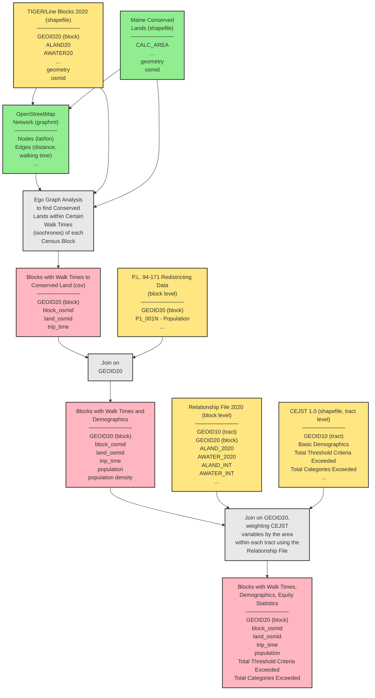

[](https://github.com/PhilipMathieu/access/actions/workflows/pages/pages-build-deployment)
# access

This project analyzes spatial accessibility to conservation lands, with a focus on demographic disparities in access.

## Documentation

I am in the process of a major overhaul of this repo which will eventually include adding better documentation. For now, the best starting point is the [notebooks/](notebooks/) subdirectory, which contains a sequence of Jupyter notebooks that demonstrate the analysis workflow and show how to use the Python modules.

**Note:** Core data processing logic has been migrated to standalone Python modules in `src/` for better maintainability and to support expansion to all of New England. The notebooks have been updated to show both the original implementation and examples using the new modules.

For questions, please contact Philip Mathieu (mathieu.p@northeastern.edu).

## Backlog

If you're curious about work in progress on this project, see [BACKLOG.md](BACKLOG.md).

## Visual Summary



## Data Files

For information about data files, their sources, processing workflows, and how to update them (especially for webmap updates), see **[DATA_DICTIONARY.md](DATA_DICTIONARY.md)**.

The data dictionary includes:
- Webmap file locations and update procedures
- Raw data source information
- Processing workflows
- File naming conventions
- Troubleshooting guides

## Environment Setup

This project uses `uv` for Python environment and package management.

### Prerequisites

1. Install `uv` (if not already installed):
   ```bash
   curl -LsSf https://astral.sh/uv/install.sh | sh
   ```

2. Install Python 3.10 (if needed):
   ```bash
   uv python install 3.10
   ```

### Setup

1. Create virtual environment and install dependencies:
   ```bash
   uv venv
   source .venv/bin/activate  # or `.venv\Scripts\activate` on Windows
   uv pip install -e .
   ```

2. Set up Jupyter kernel (for notebooks):
   ```bash
   # Make sure the venv is activated first
   source .venv/bin/activate  # or `.venv\Scripts\activate` on Windows
   
   # Register the kernel using the venv python
   .venv/bin/python -m ipykernel install --user --name access --display-name "Python 3 (access)"
   ```

The notebooks in the `notebooks/` directory should use the "Python 3 (access)" kernel, which will use the Python interpreter from `.venv/bin/python`.

### Census API Key

The project uses the U.S. Census Bureau API to fetch demographic data. You'll need a free API key to access this data.

**Getting an API Key:**

1. Visit the [Census API Key Request Page](https://api.census.gov/data/key_signup.html)
2. Fill out the form with your name and email address
3. Submit the form
4. Check your email for your API key and activation link
5. Click the activation link to activate your key

**Setting Up Your API Key:**

Create a `.env` file in the project root and add your API key:

```bash
CENSUS_API_KEY=your_api_key_here
```

Alternatively, you can pass the API key as a command-line argument when running the pipeline:

```bash
python src/run_pipeline.py --census-api-key your_api_key_here
```

**Important:** The project uses caching to reduce API key dependency. After the first successful run with an API key, census data is cached locally in `data/cache/census/`. Subsequent runs will automatically use the cached data and **won't require an API key** unless you want to refresh the cache.

To force a refresh of the cached data, use the `refresh_cache=True` parameter or delete the cache files in `data/cache/census/`.

## Using the Modules

The project includes several Python modules for data processing:

### Walk Times (`src/walk_times/`)

Calculate walk times from geographic units to conserved lands:

```python
from walk_times.calculate import process_walk_times
from config.defaults import DEFAULT_TRIP_TIMES, DEFAULT_TRAVEL_SPEED

df = process_walk_times(
    geography_type="blocks",
    graph_path="data/graphs/maine_walk.graphml",
    geography_path="data/blocks/tl_2020_23_tabblock20_with_nodes.shp.zip",
    conserved_lands_path="data/conserved_lands/Maine_Conserved_Lands_with_nodes.shp.zip",
    output_path="data/walk_times/walk_times_block_df.csv",
    trip_times=DEFAULT_TRIP_TIMES,
    travel_speed=DEFAULT_TRAVEL_SPEED,
)
```

### Merging (`src/merging/`)

Merge walk times with blocks and add census/CEJST data:

```python
from merging.blocks import merge_walk_times, dissolve_blocks
from merging.analysis import create_ejblocks

# Merge walk times with blocks
merge = merge_walk_times(
    blocks_path="data/blocks/tl_2020_23_tabblock20_with_nodes.shp.zip",
    walk_times_path="data/walk_times/walk_times_block_df.csv",
    conserved_lands_path="data/conserved_lands/Maine_Conserved_Lands_with_nodes.shp.zip",
)

# Create ejblocks with census and CEJST data
# Note: census_api_key is optional if cached data exists (see Census API Key section above)
import os
ejblocks = create_ejblocks(
    blocks_path="data/joins/block_dissolve.shp.zip",
    census_api_key=os.getenv("CENSUS_API_KEY"),  # Optional if cached
    cejst_path="data/cejst-me.zip",
    relationship_file_path="data/tab2010_tab2020_st23_me.txt",
    output_path="data/joins/ejblocks.shp.zip",
    state_fips="23",
)
```

### Analysis (`src/analysis/`)

Statistical analysis of access disparities:

```python
from analysis.statistical import create_boolean_columns, run_manova, analyze_access_disparity
from config.defaults import DEFAULT_TRIP_TIMES

cols = [f"AC_{t}" for t in DEFAULT_TRIP_TIMES]
ejblocks = create_boolean_columns(ejblocks, cols)

# Run MANOVA
fit = run_manova(ejblocks, dependent_vars=cols, independent_var="TC")

# Analyze access disparity
tab, table = analyze_access_disparity(ejblocks, access_col="AC_10_bool", disadvantage_col="TC_bool")
```

### Visualization (`src/visualization/`)

Generate publication figures:

```python
from visualization.figures import generate_all_figures

generate_all_figures(
    ejblocks_path="data/joins/ejblocks.shp.zip",
    output_dir="figs/",
)
```

### H3 (`src/h3/`)

H3 hexagon spatial indexing:

```python
from h3.relationship import generate_h3_relationship_area
from h3.joins import h3_join

# Generate H3 relationship file
generate_h3_relationship_area(
    blocks_path="data/blocks/tl_2020_23_tabblock20.zip",
    output_path="data/blocks/tl_2020_23_tabblock20_h3_10.csv",
    resolution=10,
)

# Join data with H3 relationship file
df_h3 = h3_join("data/joins/ejblocks.shp.zip", resolution=6)
```

### Configuration (`src/config/`)

Region configuration for multi-state support:

```python
from config.regions import get_region_config, NEW_ENGLAND_STATES

# Get configuration for a state
maine_config = get_region_config("Maine")  # or "23" or "ME"

# Access state-specific paths
blocks_path = maine_config.get_blocks_path(with_nodes=True)
```

For more examples, see the notebooks in the `notebooks/` directory.

## Local Development

To test the site locally before deploying to GitHub Pages, use `http-server` which supports HTTP range requests required for PMTiles:

```bash
# Install http-server globally (if not already installed)
npm install -g http-server

# Navigate to the docs directory and start the server
cd docs
http-server -p 8000 --cors
```

The site will be available at `http://localhost:8000`. The `--cors` flag enables Cross-Origin Resource Sharing, which is important for PMTiles to work correctly.

**Note:** Python's `http.server` does not support HTTP range requests, which are required for PMTiles. Use `http-server` instead for local testing.

